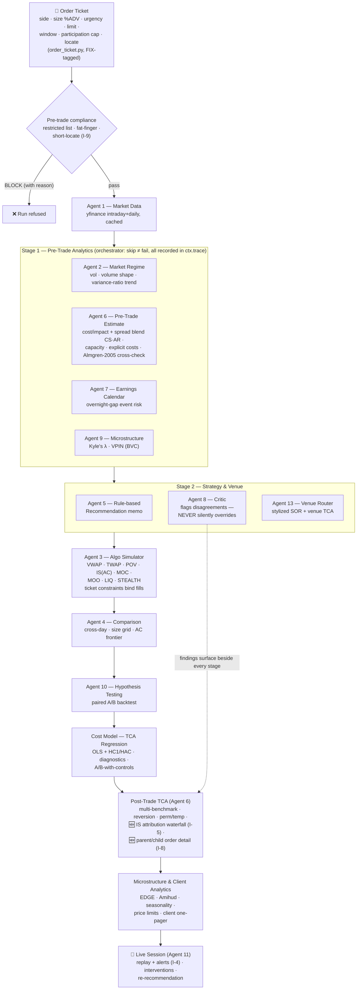
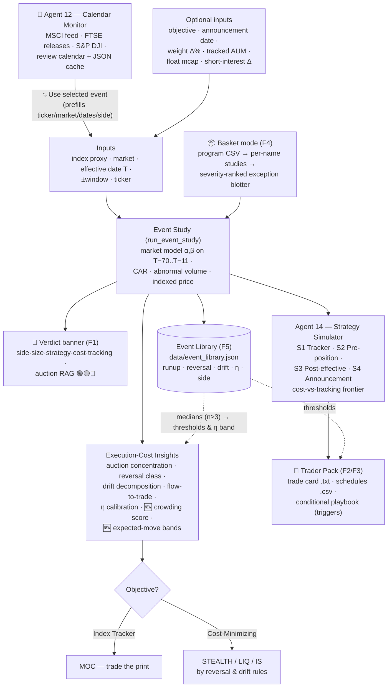
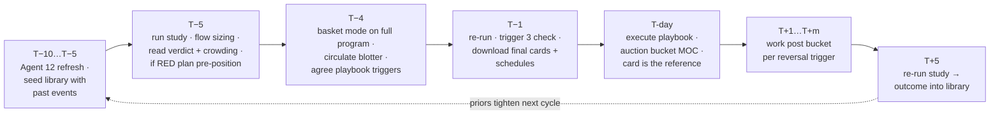
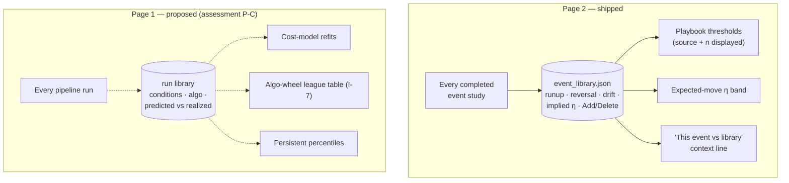

# Architecture Diagrams — Execution Simulator & Index Rebalancing Tool

*2026-07-08. Single source of truth for the platform's flow diagrams.
Written in Mermaid so they are text, versioned with the code, and render
automatically on GitHub / VS Code / mermaid.live — when the design changes,
edit the block here (each diagram carries a node→module map telling you what
to touch), commit, done. No image files to regenerate.*

**How to update:** each node label carries the module/agent it represents.
Add an agent → add one node + one arrow. Rename a section in `app.py` → rename
the matching node. Keep labels in double quotes; use ` ` for line breaks.
Preview at https://mermaid.live or in the GitHub file view.

**Standalone copies:** `docs/diagrams/D1–D4.mermaid` are extracted previews
for viewers that render `.mermaid` files directly. THIS file is canonical —
if you edit a diagram here, re-extract the block to its `.mermaid` twin
(copy-paste the block body) or delete the twins if they drift.

---

## D1 — Page 1: Execution Algorithm Simulator (order lifecycle)

Node → module map: Ticket/compliance = `agents/order_ticket.py` (+ I-9 checks
in app.py) · Data = `agent1_market_data` · Regime = `agent2` · Pre-trade =
`agent6.build_pretrade_estimate` (+ `explicit_costs`, Almgren-2005 cross-check)
· Earnings = `agent7` · Microstructure = `agent9` · Venue/SOR = `agent13` ·
Simulator = `agent3` · Comparison = `agent4` · Recommendation = `agent5` ·
Critic = `agent8` · A/B = `agent10` · Cost model = `cost_model`/`cost_panel` ·
Post-trade = `agent6.build_posttrade_tca` (incl. `build_is_attribution`, I-5)
· Research analytics = `microstructure_analytics`/`asian_markets`/
`client_analytics` · Live = `agent11` + `agent3.simulate_with_interventions`.
Orchestration/graceful degradation = `agents/orchestrator.py` (ctx.trace).

## D2 — Page 2: Index Rebalancing Analysis (event → strategy → trader pack)

Node → module map: Calendar/feeds = `agent12_index_calendar` · Event study +
insights = `rebalancing_event_study` · Strategist = `agent14_rebalance_
strategist` · Verdict/card/playbook/basket/library/crowding/expected-move =
`trader_view` · UI wiring = `views/page2_rebalancing.py` (B8 refactor 2026-07-08; app.py is
now a thin dispatcher — Page 1 = `views/page1_simulator.py`, Page 3 =
`views/page3_program.py`, shared helpers = `views/common.py`).

## D3 — The trader's event timeline (how the tools are used around T)

## D4 — Learning loops (what accumulates, what it feeds)

Run library on Page 1 is proposed (assessment P-C), shown dashed.

