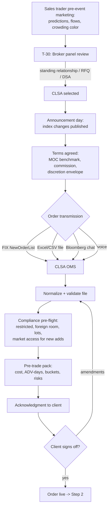
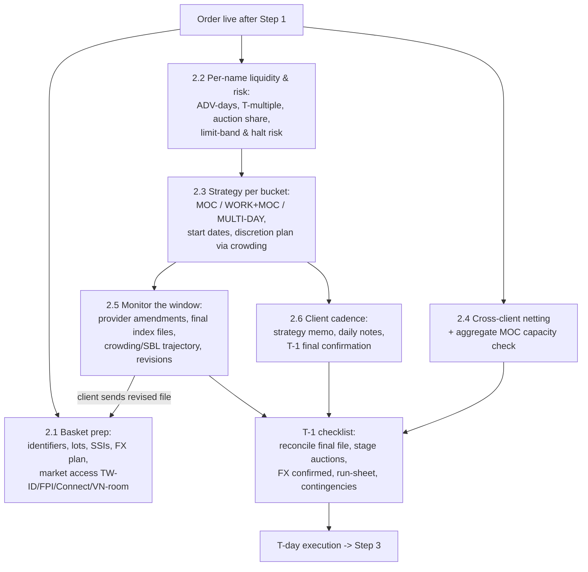
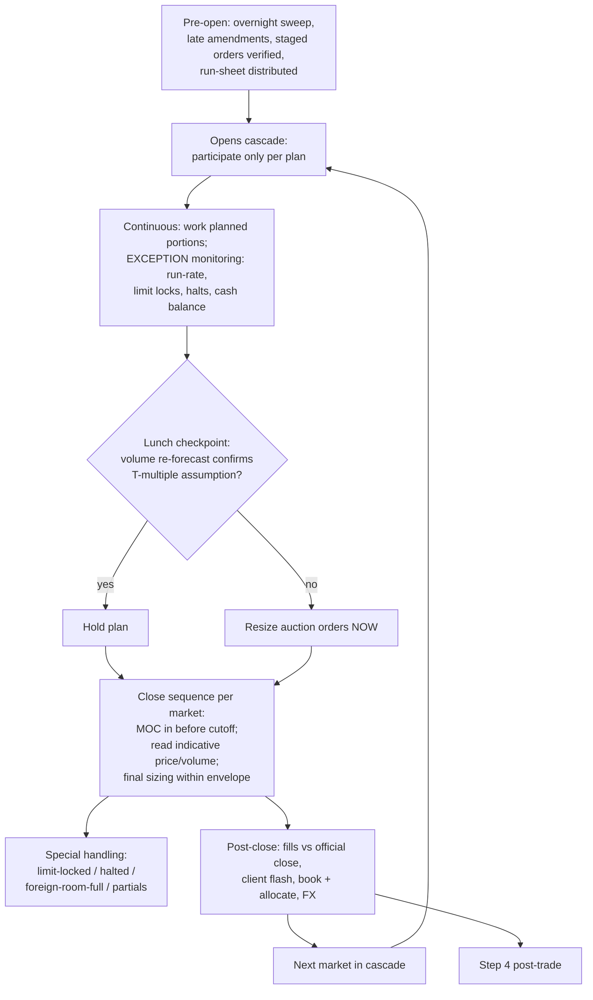
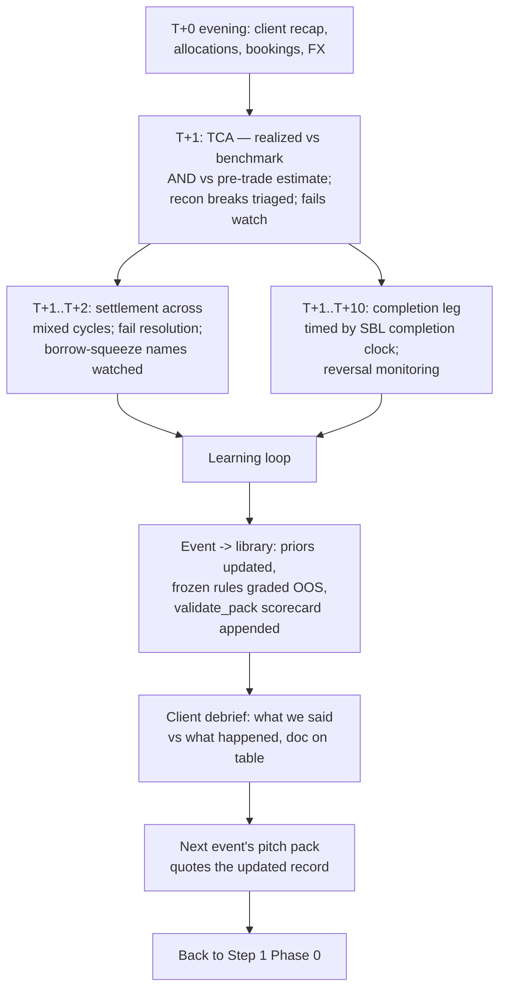

# Index Rebalance Trade Lifecycle — How a PT Desk Executes for Clients

*Living reference. One section per lifecycle step, each with a flowchart
and a mapping to this project's tools. Steps are added as we walk the
cycle. Timeline anchors use the MSCI Aug-2026 QIR (announce Aug 12,
effective close Aug 31 / Sep 1).*

---

## Step 1 — Order placement: how the client initiates the trade

**The key insight: initiation begins weeks before any order exists.**
Broker selection IS the competition; by the time the order arrives it is
close to a formality.

### Phase 0 — Winning the trade (T-30 → announcement)

Passive managers award rebalance trades via: a standing program
relationship ("CLSA always gets our Asia slice"), a per-event commission
RFQ across 3–5 brokers, or self-service DSA (client drives the broker's
MOC/participation algos at lower rates). The sales trader's pre-event
marketing — predicted adds/deletes, expected flows, crowding color — is
what wins this phase (our screener/flow-sim output is exactly this
artifact). Client landscape, honestly: mega-passives mostly execute
in-house; the realistic clients are mid-size global managers, regional
trackers, insurers, pensions, transition managers, hedge funds.

### Phase 1 — Terms (announcement → T-2)

Benchmark = **official closing price on effective date** (the fund is
marked against the index close, so perfect execution = the auction
print). Agreed: commission rate, and the DISCRETION ENVELOPE —
strictly-MOC-only vs "work up to X% ahead of the close" vs multi-day
schedule for illiquid names (our ADV-day buckets are this conversation).
A blind profile may precede for quoting; for index trades the NAMES are
public — what stays confidential is the client's size and constraints.

### Phase 2 — The order arrives (T-1 → T morning)

Transmission paths, descending institutional-ness: FIX basket
(NewOrderList) OMS→OMS; Excel/CSV via email/secure portal (ubiquitous —
hence the file normalizer); Bloomberg IB chat + attachment; voice for
sensitive size. Content beyond side/qty: multi-fund allocations,
settlement instructions, FX handling (broker vs custodian), cash
neutrality (sells fund buys), restricted names, per-market completion
instructions.

**Index-trade-specific wrinkles:** timing is common knowledge — the
client buys auction quality + discretion judgment, not secrecy; new
adds may need market-access setup (Taiwan foreign-investor ID, India
FPI, China Connect eligibility, Vietnam foreign room) so clients
initiate EARLY in access-controlled markets; multi-market programs
arrive as one list with follow-the-sun handoffs.

### Phase 3 — Acknowledgment loop (same day)

Ingest → normalize → compliance pre-flight → pre-trade pack →
confirmation back (line count, notional, benchmark, per-bucket
strategy, exceptions: odd lots, restricted, limit-band risks). Client
signs off. Instruction + confirmation = first audit-trail entry.

### Flowchart

### Project mapping (Step 1)

| Lifecycle element | Our tool |
|---|---|
| Pre-event marketing | reconstitution screener + index_flow sim + crowding overlay |
| Blind profile / quote | basket_risk.blind_profile, agency_quote_sketch |
| File intake | pt_ops.client_file_normalizer (+ proposed basket linter) |
| Pre-flight | pt_dealer compliance pre-flight (reads Reg-Watch registry) |
| Pre-trade pack | desk_pack + index_flow.recommend_execution |
| Audit-trail start | build_audit_pack (instructions + checks + rules_version) |

---

## Step 2 — Announcement → effective day: what the desk does before T

**The organizing fact: this window (13 trading days for the Aug QIR) is
where execution quality is actually determined.** T-day is the exam;
this window is the studying. Six workstreams run in parallel.

### 2.1 Basket preparation & market access

Re-validate the file as index data finalizes; resolve identifier and
lot-size issues NOW, not on T. Access checks per market: Taiwan
foreign-investor ID registration for clients new to adds, India FPI
status, China Connect northbound eligibility + daily quota awareness,
Vietnam foreign-room headroom (a HOSE add can be unbuyable for
foreigners — flag at announcement). Confirm SSIs, custodian
instructions, and the FX funding plan per currency (KRW/TWD/INR have
pre-funding and FX-control wrinkles; settlement-date holiday collisions
across currencies checked NOW).

### 2.2 Liquidity & risk analysis per name

For every line: ADV-days, expected T-day volume multiple (our measured
16–38× for MSCI deletes vs ~5× FTSE), expected auction share, limit-band
risk (the Compermed-type name that can lock limit-down), halt/suspension
risk, and borrow status for any short legs. Output: the per-name bucket
map (MOC / WORK+MOC / MULTI-DAY) that drives everything downstream.

### 2.3 Execution planning & the discretion decision

Per-bucket strategy from the frontier under the client's tracking
tolerance — including WHEN to start multi-day names (start date =
effective date minus ADV-days needed at the participation cap).
The agency discretion decision: for names where the client granted an
envelope, decide pre-position vs wait using CROWDING (SBL build,
foreign flow, price drift vs volume): a crowded delete has spent its
pressure — work it; an uncrowded add will jump at the close — consider
pre-positioning within the envelope. Every discretionary choice gets a
documented rationale (best-ex evidence, written as a by-product).

### 2.4 Cross-client netting & capacity

Aggregate ALL clients' rebalance orders: offsetting flows (one client's
add-driven buy vs another's portfolio sell) are crossing candidates
where market rules permit (per-market crossing mechanics differ: TW
block session, HK direct business, JP ToSTNeT) — less footprint, better
prints for both sides. Then capacity: the desk's AGGREGATE MOC
footprint per name vs expected auction size — if CLSA's combined orders
would be 30% of the THSR closing auction, that changes the plan (and
the client conversations).

### 2.5 Event monitoring (the window is not static)

Index providers AMEND: names suspended before T get dropped, corporate
actions change shares/FIF, final index files (T-2/T-1) revise weights.
The desk watches provider notices daily and re-versions the basket on
each client amendment (the revision-differ problem). Market
surveillance continues: crowding trajectory, SBL builds, block prints,
futures basis — updating the discretion plan. Client updates quantities
T-1 off the final index file; expect a revised file and re-run the
whole validation chain on it.

### 2.6 Client communication cadence

Strategy memo after acknowledgment; for multi-day names a DAILY
progress note (worked X%, vs plan, market color); T-1 final
confirmation call/note: final quantities loaded, benchmark reconfirmed,
contingency plan stated (halt procedure, typhoon closure fallback for
TW/HK, what happens to unexecuted residuals). Escalation contacts for
T-day.

### T-1 checklist (the night before)

Final index file reconciled vs client file; auction orders staged where
markets allow early entry; FX legs confirmed; run-sheet printed
(cascade of cutoffs in HKT); capacity flags reviewed; contingency
playbook at hand; audit pack current.

### Flowchart

### Project mapping (Step 2)

| Workstream | Our tool |
|---|---|
| 2.1 prep & access | client_file_normalizer, settlement/FX warnings (pt_ops), Reg-Watch registry (market rules) |
| 2.2 liquidity/risk | **event_window.liquidity_risk_sheet** (session 8g: ADV-days + measured T-multiple + auction-footprint % + band/borrow/halt flags + bucket, one table); inputs: event_flow_study T-multiples, asian_markets bands, sbl_utilization (TWT93U balance/(balance+remaining quota) — the one public quota file), multi-market crowding archive |
| 2.3 strategy & discretion | **event_window.start_schedule** (start = eff − ceil(ADV-days/cap) bdays, LATE START escalation) + **discretion_decision** (crowding-driven pre-position/wait/work rule matrix, EXITING flip, no-envelope = MOC-only; best-ex rationale emitted as a by-product) + recommend_execution frontier for the per-bucket strategy |
| 2.4 netting & capacity | pt_ops crossing detector; aggregate capacity needs MULTI-CLIENT order data — desk-only, honestly out of scope here (the per-name auction-footprint % in 2.2 is the single-client primitive) |
| 2.5 monitoring | forward fetch (SBL/blocks) now MULTI-MARKET (fetch_crowding_asia), Reg-Watch watch mode, event radar; revision differ (proposed) |
| 2.6 client cadence | EOD/progress note drafts (pt_automation), QBR machinery for language |
| T-1 checklist | auction_countdown, audit pack, cascade run-sheet (proposed) |

*Live demo: docs/case_studies/EVENT_WINDOW_PLAN_DEMO_AUG2026.md —
boundary names with live crowding/borrow reads; the discretion matrix
visibly keyed to the data (crowded delete 1101 works ahead; EXITING
names wait; the no-envelope line stays MOC-only).*

---

## Step 3 — T-day: executing into the print

**The organizing fact: T-day is mostly the disciplined execution of
decisions already made — the new information is the auctions
themselves.** The day runs as the Asia cascade, each market hitting the
same sequence a few hours apart.

### 3.1 Pre-open (per market)

Overnight sweep on event names: halts, M&A headlines, provider
late amendments (a name suspended overnight comes OUT — re-run the
basket). Verify staged auction orders against the final reconciled
file; distribute the run-sheet (every cutoff in HKT); review capacity
flags one last time. Opening auctions: participate only where the plan
says so (most rebalance flow is CLOSE-auction business).

### 3.2 Continuous session

Work the WORK+MOC intraday portions and MULTI-DAY completion legs at
planned participation. Monitor BY EXCEPTION: run-rate vs plan, limit
proximity (event names gap — the ±10% band names can lock), halts,
buy/sell balance vs the cash constraint. Volume run-rate re-forecast at
lunch: is today's liquidity confirming the T-multiple assumption? If
the tape says 8x instead of 16x, auction sizing changes NOW, not at
13:20. Client revisions still arrive; each re-validated.

### 3.3 The close sequence (the heart of the day)

Per market, in cascade: enter/adjust MOC orders BEFORE the cutoff
(TW 13:25, JP 15:25, KR 15:20, HK CAS phases, CN 14:57 no-cancel);
then read the auction: Taiwan broadcasts indicative price/volume
13:25–13:30 — compare indicative volume against the expected
T-multiple; a thin auction means the print will be violent, a rich one
means the crowd showed up. Within the discretion envelope, final
sizing reacts to the indicative (the one real-time decision of the
day). Special handling from the T-1 contingency note: limit-locked
names (queue-or-retreat), halted names (documented fallback), foreign-
room-full lines, partial fills.

### 3.4 Immediately post-close (per market)

Capture fills; verify benchmark = official close per line; flash the
client ("done; 96% at the close; tracking +2.1 bps; residual plan for
the 4%"); book and allocate; execute FX legs. Exceptions → the
intraday note, not tomorrow's apology. Then the cascade moves to the
next market and repeats.

### Flowchart

### Project mapping (Step 3)

| Element | Our tool |
|---|---|
| Cutoff discipline | auction_countdown (registry-fed) + run-sheet (proposed) |
| Indicative auction read | event_data.parse_auction_snapshot (live-only, cockpit) |
| Limit locks | limit_proximity WATCH/ALERT/LOCKED |
| Exception monitoring | attention_queue; alerts + acknowledge trail |
| Lunch re-forecast | flow_forecast run-rate re-forecast (DM-gated) |
| Cash-balance path | pt_ops exposure scheduler |
| Client flash / EOD | pt_automation drafts |
| Record of the day | build_audit_pack (decisions + acks + rules_version) |

*Honest gap: real-time plumbing. Our monitors run on delayed/EOD
public data; the mechanisms (thresholds, countdowns, indicative-vs-
expected logic) transfer to desk feeds unchanged.*

---

## Step 4 — Post-trade: settle, grade, learn

**The organizing fact: post-trade is where next quarter's mandate is
won.** Execution quality is now a fact; what remains is proving it,
settling it, and feeding it back.

### 4.1 T+0 evening

Client recap per line and total (avg price vs official close,
completion rate, commissions, residual plan). Allocations across the
client's funds confirmed; bookings out; FX done. The EOD note drafts
itself from the day's records — the dealer edits.

### 4.2 T+1 — TCA and reconciliation

The TCA report: realized slippage vs benchmark per line, timing/impact/
spread attribution, and — the differentiator — REALIZED vs PRE-TRADE
ESTIMATE, line by line (the predicted-vs-realized loop; most brokers
send TCA, few reconcile it against what they promised). Recon vs
client/custodian records; breaks auto-triaged by likely cause; fails
watch opens for tight-borrow names.

### 4.3 T+1 → T+2/T+3 — settlement

Mixed cycles across the basket (India T+1, most of Asia T+2); value
dates, FX settlement, fail resolution before buy-in windows. The
deletion names with squeezed borrow are the fails-risk names — the SBL
ledger flagged them in Step 2.

### 4.4 T+1 → T+10 — the completion leg and the unwind

For S3-style plans, the completion leg sells into the covering bounce
— timed by the completion clock (SBL unwind fraction, T+2 settlement
guard). Reversal monitoring grades the strategy choice: did the
crowded names bounce as the crowding read implied?

### 4.5 The learning loop (what makes next time better)

The event joins the library: realized T-multiples, auction shares, and
reversal fractions update the priors the NEXT pack quotes; the frozen
refined_rule gets its out-of-sample grade; validate_pack appends the
scorecard to the pitch doc — wins and misses; the client debrief walks
"what we said vs what happened" with the graded document on the table.
This loop is the compounding asset: every event makes the desk's
numbers — and its credibility — better.

### Flowchart

### Project mapping (Step 4)

| Element | Our tool |
|---|---|
| Client recap / EOD | pt_automation EOD draft |
| TCA + attribution | IS attribution, markouts, cost model; quarterly_review aggregation |
| Realized vs pre-trade estimate | **execution_insights.tca_vs_estimate** (session 8i: per-line reconciliation, WITHIN/BETTER/WORSE verdicts, qty-weighted portfolio delta) |
| Discretion grading | **execution_insights.discretion_counterfactual** (each Step-2 choice vs the realized path; roads-not-taken graded hypothetically) |
| Reversal vs crowding read | **execution_insights.reversal_grade** (HIGH/LOW implications falsifiable; MED/no-data excluded from the quoted hit rate) |
| Prior updates | **execution_insights.update_priors** (event joins the library; before/after medians the next pack quotes) |
| Client debrief | **execution_insights.render_debrief** — "what we said vs what happened", misses included (demo: EXECUTION_INSIGHTS_DEMO_MAY2026.md) |
| Predicted-vs-realized | run library (desk_pack loop) |
| Recon triage | pt_ops recon classifier |
| Settlement calendar | pt_ops holiday-aware settlement + FX notes |
| Completion timing | event_data.completion_clock (T+2 guard) |
| Reversal grading | event_flow_study.grade_strategies |
| Self-grading docs | pitch_pack.validate_pack |
| Event library | event library + event_flow_study cache |

---

*The four steps close the loop: Phase-0 analytics win the mandate
(Step 1) → the window determines quality (Step 2) → T-day executes it
(Step 3) → post-trade proves it and improves the analytics that win
the next mandate (Step 4). The compounding loop IS the business
model of an agency desk.*

How the buy side values it — differs sharply by client type, and this matters for the pitch. Passive trackers mostly cannot trade on predictions (mandate: match the index, announced changes only) — they value predictions for operational lead time: arranging Taiwan IDs and borrow for likely adds, planning liquidity and discretion envelopes, budgeting expected costs for fund boards. The exception is flexible-implementation index funds that may trade within a tracking-error budget — for them accuracy is directly monetizable. Active and quant clients value predictions as trade ideas (the index-arb book). And every client receives multiple brokers' previews — the product is semi-commoditized, so differentiation comes from exactly three places: a graded public track record (nobody else grades themselves), honest probabilistic tags instead of confident lists, and the positioning overlay that says which predictions are already priced (our crowding read) — a consensus add that's fully pre-positioned is operationally important but has no alpha left, and telling clients that distinction is rarer than the prediction itself.

MSCI, explained like you're five. Imagine every company in Taiwan lined up in the schoolyard, tallest to shortest — "tall" meaning how much the whole company is worth. MSCI walks down the line with a basket, putting kids in one by one, until the basket holds about 85% of all the pocket money in the yard that's actually available to spend (some kids' money is locked up by their parents — that's "free float" — and locked-up money doesn't count). Wherever the walking stops, that last kid's height becomes the magic line. Now the rules: to get into the basket, a new kid can't just barely reach the line — they must be clearly taller (about 1.15× the line at the big May/November reviews, and a much stricter 1.8× at the February/August "quarterly" reviews, so borderline kids don't hop in and out). To get kicked out, a kid must shrink to clearly below the line — about half its height. And there are two bonus rules: enough of your pocket money must be spendable (float test — this is what blocked Rainbow Robotics), and people must actually trade your shares regularly (liquidity test). MSCI does this measuring four times a year, tells everyone the results on announcement day, and everything changes on one single closing bell three weeks later.

FTSE, explained like you're five. FTSE runs it like a football league with promotion and relegation. The Taiwan 50 is a 50-team league: rank everyone by size; if a team outside the league climbs to 40th place or better, it's promoted; if a team inside falls to 61st or worse, it's relegated; and there's a substitutes bench (the reserve list) in case someone drops out mid-season. The gap between 40 and 61 is deliberate — a team bouncing between 45th and 55th stays put, so the league doesn't churn. The important difference from MSCI: promotion depends on beating your neighbors' ranks, and around 50th place everyone is nearly the same size — so tiny measurement wiggles reorder the table. That's why our FTSE deletion calls are honest "watch zones" while MSCI deletion calls are firm: MSCI's magic line moves with the whole yard's total, FTSE's depends on which of two similar kids is a centimeter taller today.

How our project predicts the changes. We play MSCI and FTSE's game before they do: rebuild the schoolyard line-up ourselves from public data (every company's size and spendable share), apply the exact same tape-measure rules, and read off who crosses the lines. Three things make it more than a copy of the rulebook. First, we say how sure we are: every call carries its distance from the line, and we shake the measurements around (Monte Carlo) to see which calls survive the shaking — that's how we discovered the MSCI-firm/FTSE-fragile asymmetry rather than assumed it. Second, we grade ourselves in public: five real reviews so far — adds 11/11, coverage-rule deletions 14/14, rank-boundary deletions ~50–60% and labeled as such — and the misses taught us that when we're wrong it's almost never the tape measure, it's the list of kids (a stale membership file, a bad cap estimate), which is why unvalidated markets get NO-CALL. Third, we check who's already betting: the short-sale ledger shows which of our predictions the playground has already wagered on — a prediction everyone's positioned for is operationally useful but has no surprise left, and telling clients which is which is the part nobody else does.

One sentence to carry into the interview: MSCI measures kids against a line the whole yard sets; FTSE ranks neighbors against each other; we rebuild both games from public data, state our confidence, grade our answers, and check the betting — and the next exam is August 12.