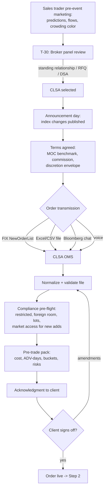
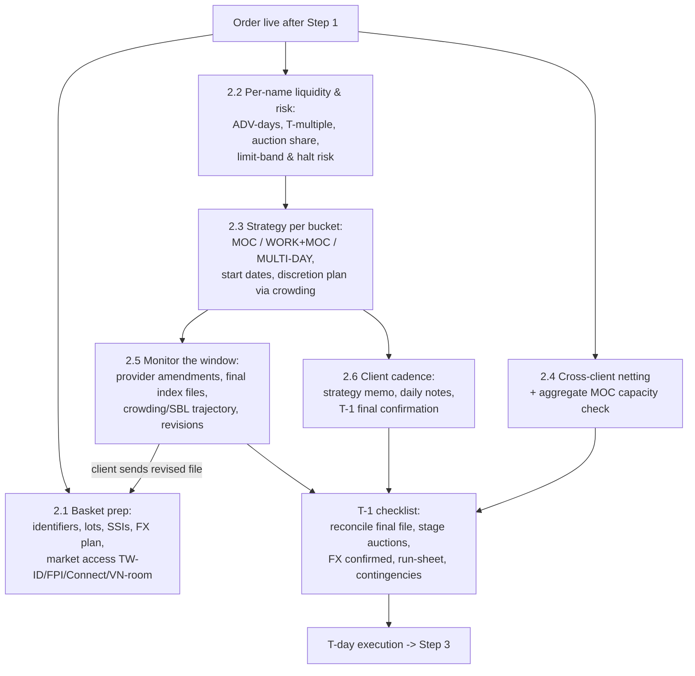
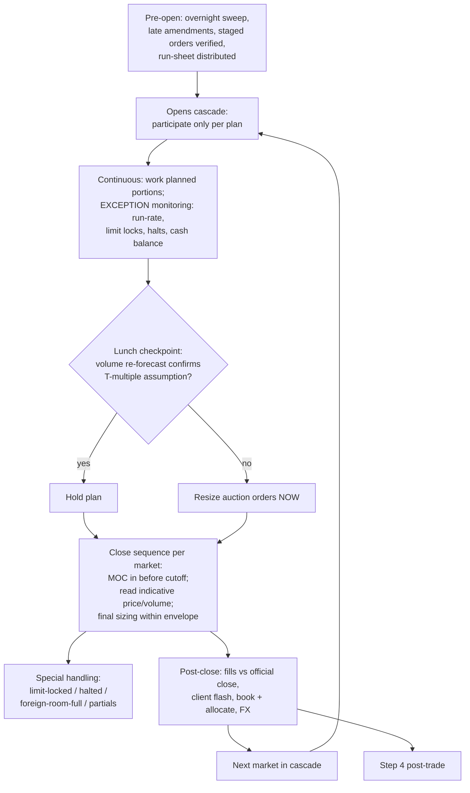
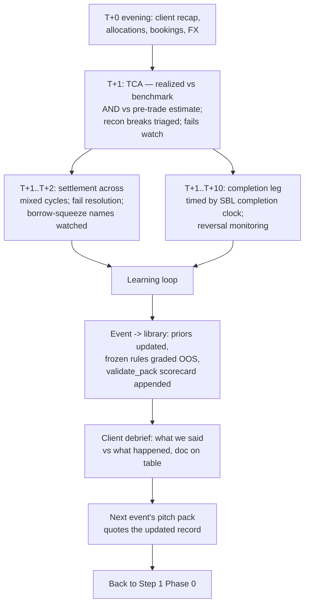

# Index Rebalance Trade Lifecycle — How a PT Desk Executes for Clients

*Living reference. One section per lifecycle step, each with a flowchart
and a mapping to this project's tools. Steps are added as we walk the
cycle. Timeline anchors use the MSCI Aug-2026 QIR (announce Aug 12,
effective close Aug 31 / Sep 1).*

---

## Correlation between the growth of indexing and MOC volume
Trading patterns in global equity markets have shifted materially over the past decade, likely driven in large part by the expansion of indexing and passive investment strategies. As these strategies have grown to represent a significant share of global assets under management, their operational requirements—particularly the need for precise benchmark alignment—have reshaped market microstructure. Index funds and ETFs are structurally incentivized to execute trades at the closing auction because official net asset values (NAVs) are calculated using closing prices, and any deviation can result in tracking error. Consequently, Market-on-Close (MOC) orders have become the dominant mechanism for end-of-day execution, concentrating liquidity at the close. This surge in closing-auction activity now accounts for a substantial share of daily volume, elevating its role in price discovery and risk transfer across modern equity markets.1
https://www.ssga.com/hk/en/institutional/insights/how-passive-investing-reshaping-microstructure
https://www.morningstar.com/financial-advisors/hidden-costs-passive-investing

1) Slippage (Relaxing Price)
As discussed above, index replication funds are the classic case of slippage. They effectively ignore price by prioritizing quantity and time to minimize tracking error. As a result, they pay higher prices when buying and accept lower prices when selling. These costs show up as slippage.

2) Latency (Relaxing Time)
Large systematic managers attempt to reduce slippage by remaining flexible and limiting their participation in daily trading volume, typically to 1%–3% of average daily volume. For smaller managers, or highly liquid large-cap stocks, this constraint is immaterial. However, for mega-firms trading less-liquid small-value securities, it creates a latency problem. Positions may take quarters, or even years, to build or unwind.

Consider a firm with $50 billion in US small-value strategies: trading 2% of ADV every single day, it would take over a year to reach market weights for a fourth of its eligible universe. That delay creates significant opportunity costs. Factor premiums such as size, value, and profitability tend to persist for four to five years. The result is that a large share of a premium may be missed if it takes over a year just to establish a position. Latency also makes it nearly impossible to capture shorter-lived return drivers, such as momentum; short-term reversals; or cash mergers; which operate over days, weeks, or months rather than years. Mega-firms are forced to treat these shorter-term drivers as trading filters rather than full premiums because they are unable to fully capture them, given their size. And known poor performers, such as small-growth firms with high investment and low profitability, may take months to divest from rather than days, creating a drag on performance.

3) Dilution (Relaxing Quantity)
To reduce both slippage and latency, large firms often spread trades across more names. For example, instead of concentrating in the 100 securities with the highest expected returns, they may expand to 500 or 1,000. While these names may still have positive expected returns, each step down the ladder dilutes exposures. Thus, the portfolio drifts closer to the market and away from the factor premiums investors seek.

Dilution also arises across factors. For example, momentum, a premium with a three- to six-month horizon, requires turnover that mega-firms cannot realistically execute without incurring severe transaction costs. Rather than actively pursue this premium, they may use it as a reason not to trade. Unable to focus their buys on higher expected return “up momentum” names owing to their size, they factor in momentum by avoiding buying “down momentum” securities. While this half-measure is better than nothing, it often isn’t even executed. Mega-firms frequently are forced to relax this constraint and buy “down momentum” names to get capital invested or maintain portfolio characteristics. There are times when large asset managers have 50% of their buys in “down momentum” securities. Their size actively works against them, resulting in neutral or negative momentum loadings.

## Market implications
Institutional traders benchmarked to the close increasingly view the auction as the most reliable source of liquidity. The closing print concentrates a significant share of daily volume, supported by predictable contra flow from index funds and ETFs. Trading at the close is often cost-effective because spreads compress sharply in the final minutes compared to the open, where volatility can be higher and spreads wider as the market digests overnight news and information. This makes the close attractive for minimizing price slippage and reducing trading costs. However, this advantage is not uniform.

Waiting until the close, which is intended to minimize tracking error and benefit from deeper liquidity, can paradoxically push prices away from their pre-auction equilibrium. The more participants cluster at the close, the greater the risk that the perceived or forecasted auction price is affected by the cumulative impact of these orders. This effect is particularly pronounced on rebalance days, when passive and active flows converge and the closing price can end up materially above or below the last traded price just minutes before the auction.

## Step 1 — Order placement: how the client initiates the trade

**The key insight: initiation begins weeks before any order exists.**
Broker selection IS the competition; by the time the order arrives it is
close to a formality.

### Phase 0 — Winning the trade (T-30 → announcement)

Passive managers award rebalance trades via: a standing program
relationship ("CLSA always gets our Asia slice"), a per-event commission
RFQ across 3–5 brokers, or self-service DSA (client drives the broker's
MOC/participation algos at lower rates). The sales trader's pre-event
marketing — predicted adds/deletes, expected flows, crowding color — is
what wins this phase (our screener/flow-sim output is exactly this
artifact). Client landscape, honestly: mega-passives mostly execute
in-house; the realistic clients are mid-size global managers, regional
trackers, insurers, pensions, transition managers, hedge funds.

### Phase 1 — Terms (announcement → T-2)

Benchmark = **official closing price on effective date** (the fund is
marked against the index close, so perfect execution = the auction
print). Agreed: commission rate, and the DISCRETION ENVELOPE —
strictly-MOC-only vs "work up to X% ahead of the close" vs multi-day
schedule for illiquid names (our ADV-day buckets are this conversation).
A blind profile may precede for quoting; for index trades the NAMES are
public — what stays confidential is the client's size and constraints.

### Phase 2 — The order arrives (T-1 → T morning)

Transmission paths, descending institutional-ness: FIX basket
(NewOrderList) OMS→OMS; Excel/CSV via email/secure portal (ubiquitous —
hence the file normalizer); Bloomberg IB chat + attachment; voice for
sensitive size. Content beyond side/qty: multi-fund allocations,
settlement instructions, FX handling (broker vs custodian), cash
neutrality (sells fund buys), restricted names, per-market completion
instructions.

**Index-trade-specific wrinkles:** timing is common knowledge — the
client buys auction quality + discretion judgment, not secrecy; new
adds may need market-access setup (Taiwan foreign-investor ID, India
FPI, China Connect eligibility, Vietnam foreign room) so clients
initiate EARLY in access-controlled markets; multi-market programs
arrive as one list with follow-the-sun handoffs.

### Phase 3 — Acknowledgment loop (same day)

Ingest → normalize → compliance pre-flight → pre-trade pack →
confirmation back (line count, notional, benchmark, per-bucket
strategy, exceptions: odd lots, restricted, limit-band risks). Client
signs off. Instruction + confirmation = first audit-trail entry.

### Flowchart

### Project mapping (Step 1)

| Lifecycle element     | Our tool                                                    |
| --------------------- | ----------------------------------------------------------- |
| Pre-event marketing   | reconstitution screener + index_flow sim + crowding overlay |
| Blind profile / quote | basket_risk.blind_profile, agency_quote_sketch              |
| File intake           | pt_ops.client_file_normalizer (+ proposed basket linter)    |
| Pre-flight            | pt_dealer compliance pre-flight (reads Reg-Watch registry)  |
| Pre-trade pack        | desk_pack + index_flow.recommend_execution                  |
| Audit-trail start     | build_audit_pack (instructions + checks + rules_version)    |

---

## Step 2 — Announcement → effective day: what the desk does before T

**The organizing fact: this window (13 trading days for the Aug QIR) is
where execution quality is actually determined.** T-day is the exam;
this window is the studying. Six workstreams run in parallel.

### 2.1 Basket preparation & market access

Re-validate the file as index data finalizes; resolve identifier and
lot-size issues NOW, not on T. Access checks per market: Taiwan
foreign-investor ID registration for clients new to adds, India FPI
status, China Connect northbound eligibility + daily quota awareness,
Vietnam foreign-room headroom (a HOSE add can be unbuyable for
foreigners — flag at announcement). Confirm SSIs, custodian
instructions, and the FX funding plan per currency (KRW/TWD/INR have
pre-funding and FX-control wrinkles; settlement-date holiday collisions
across currencies checked NOW).

### 2.2 Liquidity & risk analysis per name

For every line: ADV-days, expected T-day volume multiple (our measured
16–38× for MSCI deletes vs ~5× FTSE), expected auction share, limit-band
risk (the Compermed-type name that can lock limit-down), halt/suspension
risk, and borrow status for any short legs. Output: the per-name bucket
map (MOC / WORK+MOC / MULTI-DAY) that drives everything downstream.

### 2.3 Execution planning & the discretion decision

Per-bucket strategy from the frontier under the client's tracking
tolerance — including WHEN to start multi-day names (start date =
effective date minus ADV-days needed at the participation cap).
The agency discretion decision: for names where the client granted an
envelope, decide pre-position vs wait using CROWDING (SBL build,
foreign flow, price drift vs volume): a crowded delete has spent its
pressure — work it; an uncrowded add will jump at the close — consider
pre-positioning within the envelope. Every discretionary choice gets a
documented rationale (best-ex evidence, written as a by-product).

### 2.4 Cross-client netting & capacity

Aggregate ALL clients' rebalance orders: offsetting flows (one client's
add-driven buy vs another's portfolio sell) are crossing candidates
where market rules permit (per-market crossing mechanics differ: TW
block session, HK direct business, JP ToSTNeT) — less footprint, better
prints for both sides. Then capacity: the desk's AGGREGATE MOC
footprint per name vs expected auction size — if CLSA's combined orders
would be 30% of the THSR closing auction, that changes the plan (and
the client conversations).

### 2.5 Event monitoring (the window is not static)

Index providers AMEND: names suspended before T get dropped, corporate
actions change shares/FIF, final index files (T-2/T-1) revise weights.
The desk watches provider notices daily and re-versions the basket on
each client amendment (the revision-differ problem). Market
surveillance continues: crowding trajectory, SBL builds, block prints,
futures basis — updating the discretion plan. Client updates quantities
T-1 off the final index file; expect a revised file and re-run the
whole validation chain on it.

### 2.6 Client communication cadence

Strategy memo after acknowledgment; for multi-day names a DAILY
progress note (worked X%, vs plan, market color); T-1 final
confirmation call/note: final quantities loaded, benchmark reconfirmed,
contingency plan stated (halt procedure, typhoon closure fallback for
TW/HK, what happens to unexecuted residuals). Escalation contacts for
T-day.

### T-1 checklist (the night before)

Final index file reconciled vs client file; auction orders staged where
markets allow early entry; FX legs confirmed; run-sheet printed
(cascade of cutoffs in HKT); capacity flags reviewed; contingency
playbook at hand; audit pack current.

### Flowchart

### Project mapping (Step 2)

| Workstream                | Our tool                                                                                   |
| ------------------------- | ------------------------------------------------------------------------------------------ |
| 2.1 prep & access         | client_file_normalizer, settlement/FX warnings (pt_ops), Reg-Watch registry (market rules) |
| 2.2 liquidity/risk        | event_flow_study T-multiples, limit_proximity, ADV-day buckets (index_flow)                |
| 2.3 strategy & discretion | recommend_execution frontier + crowding_adjusted path, refined_rule, drift_composition     |
| 2.4 netting & capacity    | pt_ops crossing detector; capacity view (planned W2)                                       |
| 2.5 monitoring            | forward fetch (SBL/blocks), event radar, rebalance monitor; revision differ (proposed)     |
| 2.6 client cadence        | EOD/progress note drafts (pt_automation), QBR machinery for language                       |
| T-1 checklist             | auction_countdown, audit pack, cascade run-sheet (proposed)                                |

---

## Step 3 — T-day: executing into the print

**The organizing fact: T-day is mostly the disciplined execution of
decisions already made — the new information is the auctions
themselves.** The day runs as the Asia cascade, each market hitting the
same sequence a few hours apart.

### 3.1 Pre-open (per market)

Overnight sweep on event names: halts, M&A headlines, provider
late amendments (a name suspended overnight comes OUT — re-run the
basket). Verify staged auction orders against the final reconciled
file; distribute the run-sheet (every cutoff in HKT); review capacity
flags one last time. Opening auctions: participate only where the plan
says so (most rebalance flow is CLOSE-auction business).

### 3.2 Continuous session

Work the WORK+MOC intraday portions and MULTI-DAY completion legs at
planned participation. Monitor BY EXCEPTION: run-rate vs plan, limit
proximity (event names gap — the ±10% band names can lock), halts,
buy/sell balance vs the cash constraint. Volume run-rate re-forecast at
lunch: is today's liquidity confirming the T-multiple assumption? If
the tape says 8x instead of 16x, auction sizing changes NOW, not at
13:20. Client revisions still arrive; each re-validated.

### 3.3 The close sequence (the heart of the day)

Per market, in cascade: enter/adjust MOC orders BEFORE the cutoff
(TW 13:25, JP 15:25, KR 15:20, HK CAS phases, CN 14:57 no-cancel);
then read the auction: Taiwan broadcasts indicative price/volume
13:25–13:30 — compare indicative volume against the expected
T-multiple; a thin auction means the print will be violent, a rich one
means the crowd showed up. Within the discretion envelope, final
sizing reacts to the indicative (the one real-time decision of the
day). Special handling from the T-1 contingency note: limit-locked
names (queue-or-retreat), halted names (documented fallback), foreign-
room-full lines, partial fills.

### 3.4 Immediately post-close (per market)

Capture fills; verify benchmark = official close per line; flash the
client ("done; 96% at the close; tracking +2.1 bps; residual plan for
the 4%"); book and allocate; execute FX legs. Exceptions → the
intraday note, not tomorrow's apology. Then the cascade moves to the
next market and repeats.

### Flowchart

### Project mapping (Step 3)

| Element                 | Our tool                                                |
| ----------------------- | ------------------------------------------------------- |
| Cutoff discipline       | auction_countdown (registry-fed) + run-sheet (proposed) |
| Indicative auction read | event_data.parse_auction_snapshot (live-only, cockpit)  |
| Limit locks             | limit_proximity WATCH/ALERT/LOCKED                      |
| Exception monitoring    | attention_queue; alerts + acknowledge trail             |
| Lunch re-forecast       | flow_forecast run-rate re-forecast (DM-gated)           |
| Cash-balance path       | pt_ops exposure scheduler                               |
| Client flash / EOD      | pt_automation drafts                                    |
| Record of the day       | build_audit_pack (decisions + acks + rules_version)     |

*Honest gap: real-time plumbing. Our monitors run on delayed/EOD
public data; the mechanisms (thresholds, countdowns, indicative-vs-
expected logic) transfer to desk feeds unchanged.*

---

## Step 4 — Post-trade: settle, grade, learn

**The organizing fact: post-trade is where next quarter's mandate is
won.** Execution quality is now a fact; what remains is proving it,
settling it, and feeding it back.

### 4.1 T+0 evening

Client recap per line and total (avg price vs official close,
completion rate, commissions, residual plan). Allocations across the
client's funds confirmed; bookings out; FX done. The EOD note drafts
itself from the day's records — the dealer edits.

### 4.2 T+1 — TCA and reconciliation

The TCA report: realized slippage vs benchmark per line, timing/impact/
spread attribution, and — the differentiator — REALIZED vs PRE-TRADE
ESTIMATE, line by line (the predicted-vs-realized loop; most brokers
send TCA, few reconcile it against what they promised). Recon vs
client/custodian records; breaks auto-triaged by likely cause; fails
watch opens for tight-borrow names.

### 4.3 T+1 → T+2/T+3 — settlement

Mixed cycles across the basket (India T+1, most of Asia T+2); value
dates, FX settlement, fail resolution before buy-in windows. The
deletion names with squeezed borrow are the fails-risk names — the SBL
ledger flagged them in Step 2.

### 4.4 T+1 → T+10 — the completion leg and the unwind

For S3-style plans, the completion leg sells into the covering bounce
— timed by the completion clock (SBL unwind fraction, T+2 settlement
guard). Reversal monitoring grades the strategy choice: did the
crowded names bounce as the crowding read implied?

### 4.5 The learning loop (what makes next time better)

The event joins the library: realized T-multiples, auction shares, and
reversal fractions update the priors the NEXT pack quotes; the frozen
refined_rule gets its out-of-sample grade; validate_pack appends the
scorecard to the pitch doc — wins and misses; the client debrief walks
"what we said vs what happened" with the graded document on the table.
This loop is the compounding asset: every event makes the desk's
numbers — and its credibility — better.

### Flowchart

### Project mapping (Step 4)

| Element               | Our tool                                                           |
| --------------------- | ------------------------------------------------------------------ |
| Client recap / EOD    | pt_automation EOD draft                                            |
| TCA + attribution     | IS attribution, markouts, cost model; quarterly_review aggregation |
| Predicted-vs-realized | run library (desk_pack loop)                                       |
| Recon triage          | pt_ops recon classifier                                            |
| Settlement calendar   | pt_ops holiday-aware settlement + FX notes                         |
| Completion timing     | event_data.completion_clock (T+2 guard)                            |
| Reversal grading      | event_flow_study.grade_strategies                                  |
| Self-grading docs     | pitch_pack.validate_pack                                           |
| Event library         | event library + event_flow_study cache                             |

---

*The four steps close the loop: Phase-0 analytics win the mandate
(Step 1) → the window determines quality (Step 2) → T-day executes it
(Step 3) → post-trade proves it and improves the analytics that win
the next mandate (Step 4). The compounding loop IS the business
model of an agency desk.*

How the buy side values it — differs sharply by client type, and this matters for the pitch. Passive trackers mostly cannot trade on predictions (mandate: match the index, announced changes only) — they value predictions for operational lead time: arranging Taiwan IDs and borrow for likely adds, planning liquidity and discretion envelopes, budgeting expected costs for fund boards. The exception is flexible-implementation index funds that may trade within a tracking-error budget — for them accuracy is directly monetizable. Active and quant clients value predictions as trade ideas (the index-arb book). And every client receives multiple brokers' previews — the product is semi-commoditized, so differentiation comes from exactly three places: a graded public track record (nobody else grades themselves), honest probabilistic tags instead of confident lists, and the positioning overlay that says which predictions are already priced (our crowding read) — a consensus add that's fully pre-positioned is operationally important but has no alpha left, and telling clients that distinction is rarer than the prediction itself.

MSCI, explained like you're five. Imagine every company in Taiwan lined up in the schoolyard, tallest to shortest — "tall" meaning how much the whole company is worth. MSCI walks down the line with a basket, putting kids in one by one, until the basket holds about 85% of all the pocket money in the yard that's actually available to spend (some kids' money is locked up by their parents — that's "free float" — and locked-up money doesn't count). Wherever the walking stops, that last kid's height becomes the magic line. Now the rules: to get into the basket, a new kid can't just barely reach the line — they must be clearly taller (about 1.15× the line at the big May/November reviews, and a much stricter 1.8× at the February/August "quarterly" reviews, so borderline kids don't hop in and out). To get kicked out, a kid must shrink to clearly below the line — about half its height. And there are two bonus rules: enough of your pocket money must be spendable (float test — this is what blocked Rainbow Robotics), and people must actually trade your shares regularly (liquidity test). MSCI does this measuring four times a year, tells everyone the results on announcement day, and everything changes on one single closing bell three weeks later.

FTSE, explained like you're five. FTSE runs it like a football league with promotion and relegation. The Taiwan 50 is a 50-team league: rank everyone by size; if a team outside the league climbs to 40th place or better, it's promoted; if a team inside falls to 61st or worse, it's relegated; and there's a substitutes bench (the reserve list) in case someone drops out mid-season. The gap between 40 and 61 is deliberate — a team bouncing between 45th and 55th stays put, so the league doesn't churn. The important difference from MSCI: promotion depends on beating your neighbors' ranks, and around 50th place everyone is nearly the same size — so tiny measurement wiggles reorder the table. That's why our FTSE deletion calls are honest "watch zones" while MSCI deletion calls are firm: MSCI's magic line moves with the whole yard's total, FTSE's depends on which of two similar kids is a centimeter taller today.

How our project predicts the changes. We play MSCI and FTSE's game before they do: rebuild the schoolyard line-up ourselves from public data (every company's size and spendable share), apply the exact same tape-measure rules, and read off who crosses the lines. Three things make it more than a copy of the rulebook. First, we say how sure we are: every call carries its distance from the line, and we shake the measurements around (Monte Carlo) to see which calls survive the shaking — that's how we discovered the MSCI-firm/FTSE-fragile asymmetry rather than assumed it. Second, we grade ourselves in public: five real reviews so far — adds 11/11, coverage-rule deletions 14/14, rank-boundary deletions ~50–60% and labeled as such — and the misses taught us that when we're wrong it's almost never the tape measure, it's the list of kids (a stale membership file, a bad cap estimate), which is why unvalidated markets get NO-CALL. Third, we check who's already betting: the short-sale ledger shows which of our predictions the playground has already wagered on — a prediction everyone's positioned for is operationally useful but has no surprise left, and telling clients which is which is the part nobody else does.

One sentence to carry into the interview: MSCI measures kids against a line the whole yard sets; FTSE ranks neighbors against each other; we rebuild both games from public data, state our confidence, grade our answers, and check the betting — and the next exam is August 12.

Part 1 — what wins an agency rebalance quote. When several brokers pitch the same agency trade, commission is rarely the decider — it's table stakes among qualified desks (everyone quotes within a basis point). What actually ranks, in order:

Measurable execution quality. The benchmark is public and identical across brokers, so clients literally maintain league tables: your realized slippage vs the close, auction fill rates, completion rates on past events. This is the one factor that compounds — and why every basis point on every event matters beyond that event.
Local market capability. Can you handle every market and name in the basket — the Taiwan ID process, India FPI mechanics, Connect quotas, foreign-room-constrained names, odd lots, the weird ones? One "sorry, we can't do that line" loses the whole basket, because clients hate splitting.
Crossing and natural liquidity. The probability that CLSA holds offsetting flow (other clients' rebalance orders, block flow) that can cross against yours at mid — less impact, and clients know which desks have the franchise density to offer it.

### Analytics and color. Differentiated pre-event content — flow estimates, crowding reads, per-name risk flags — plus honest, detailed post-trade TCA. This is the tie-breaker among equals and the cheapest factor to be exceptional at. It's also exactly what our project produces.

### predictions + flows + crowding + measured event history + risk flags + graded track record

Operational cleanliness. No fails, clean allocations across the client's 40 funds, painless recon. Ops errors are how brokers get removed from panels — asymmetric: it can't win you the trade but absolutely loses it.
Trust and conflicts. Information handling record (did your last rebalance leak?), and the structural pitch: agency-only means no principal book positioned against the client's order. That's CLSA's cleanest differentiator against bank desks.
Relationship infrastructure. Panel status, research/corporate-access votes, service consistency — the ambient stuff that decides marginal allocations.

Part 2 — the rest of the PT desk's book, ranked by importance. Index rebalance is the flagship, but a rough ordering of everything else (revenue-weighted, for an Asia agency desk — mix varies by franchise):

Systematic/quant model turnover — the bread and butter. Quant funds rebalance monthly, weekly, some daily; recurring baskets, algo-heavy, lower touch but relentless volume. Annually this often exceeds index-event revenue precisely because it never stops.
Transitions — a pension fires manager A and hires manager B; the legacy portfolio must become the target portfolio. Episodic but enormous (single events can be billions), multi-week, high-touch, and won on exactly the same capabilities as rebalances plus confidentiality.
Cash-flow rebalances — fund inflows deployed, redemptions raised, month-end realignment to target weights. The month-end rhythm we discussed; steady, moderate-margin.
Asset-allocation restructures — "shift 3% from EM to DM," de-grossing in risk-off, sector tilts, hedge-fund pair baskets. Discretionary timing (they fill the mid-month dead zone), judgment-heavy.
ETF-linked flow — authorized participants' creation/redemption baskets and ETF market-maker hedging. Growing fast in Asia with local ETF complexes; tight margins, but it's the same in-kind baskets our 0050 paired-block proxy watches.
Derivative-linked baskets — cash-vs-futures switches (EFPs), expiry-related programs, dividend-season trades, delta-one hedge flow executed for clients. Technical, calendar-clustered around expiries.
Event-driven misc — corporate-action-driven baskets (tenders, spin-offs, share-class conversions), dual-listing migrations, and one-off client special situations.

### Is predicting per-stock weight changes necessary?

Yes — but it's the wrong verb. For membership prediction, no. For execution, absolutely — our own flow simulation showed the reweight leg was 27% of event turnover and TSMC's −$440M trim was the event's second-largest single flow; a desk that only trades adds/deletes misprices a quarter of the event. But weight changes of continuing members aren't really forecast — they're computed: in a cap-weighted index, price moves rebalance weights automatically (no flow), so tradeable weight flow comes only from discrete input updates — FIF changes, shares-outstanding updates, add/delete dilution, and capping-factor resets — all of which are deterministic once the inputs are known. So the honest formulation: weight changes are a data problem, not a prediction problem, and the skill is having clean float/shares data a day before everyone else confirms it. That's also why capped indices (TW50's single-name caps, UCITS 10/40) deserve special attention: their resets are mechanical and large.

### The idea in one sentence: before a stock officially joins or leaves an index, we check how many people have already placed their bets — because a trade everyone has already made behaves very differently from one nobody has.

How we check. When professional traders bet that a stock will be kicked out of an index, they do it by short selling — borrowing shares and selling them, planning to buy them back cheaper on the big day. Here's the useful part: in Taiwan, the stock exchange publishes a daily count of exactly how many shares of each stock have been borrowed and sold this way. It's like a public betting register. We save that count every day.

The score. We simply compare today's count to the count about six weeks ago. If borrowed-and-sold shares jumped a lot — say more than 25% — we call it HIGH: lots of people already made the bet, the trade is crowded. A small rise is MEDIUM. Little or no rise is LOW: almost nobody has positioned yet.

How do we know this register really shows index bets and not something random? Three checks on real events this year. Before the June index change was announced, the counts jumped in exactly the names everyone expected to be affected. During the weeks before the change took effect, the counts kept climbing in the affected names. And — the clincher — right after the change day, the counts collapsed in every single affected name (all nine), right on the schedule you'd expect if the bettors were closing out. Random noise doesn't build up before an event, peak at it, and vanish two days after. Bets do.

### One honest catch. The register only shows one kind of bet — the borrow-and-sell kind. Some traders bet differently: they already own the stock and quietly sell it early. That leaves no trace in this register (it happened with the May MSCI changes), so we cross-check with a second data source that shows overall foreign buying and selling.

Why a trader cares. If the trade is crowded, most of the price move has already happened — the big day will be calmer than it looks, and you can afford to be patient. If the trade is uncrowded, the full move is still coming — expect fireworks on the day and plan for them. Right now, of our four predicted additions in Taiwan, two are crowded (the market got there first) and two are untouched — and if we're right, the untouched two should jump the most. We've written that expectation down before the announcement, so afterwards anyone can check whether we were right. That's the whole philosophy: simple public data, a clear rule, and a scorecard we can't wriggle out of.

### In theory, here's the mechanics — it comes down to who's standing on the other side of the auction.

Start with what must happen on rebalancing day. The index funds are obligated to buy, say, 10 million shares at the closing price — no discretion, no price sensitivity, that exact day. That demand is fixed. The only question the market settles on T-day is: who sells them those shares, and at what price?

The uncrowded case first, as the baseline. If nobody pre-positioned, those 10 million shares must come from ordinary holders who weren't planning to sell. The only way to get reluctant holders to part with stock today is price — so the closing auction gets bid up hard until enough supply appears. You get the violent pop at the close. Then, in the days after, the price tends to fade partway back, because that elevated close reflected temporary, forced demand, not new information about the company.

Now the crowded case. Anticipating traders bought millions of shares over the preceding weeks. Two things follow. First, the price move already happened — spread quietly across those weeks as the early buyers accumulated. Second, and this is the key: on T-day those early buyers become the sellers. Their whole plan was to buy early and deliver into the index funds' forced demand at the close. So the auction is largely a hand-off: trackers buy 10 million, arbs supply most of it from inventory. Demand meets pre-arranged supply → the close clears near the prevailing price → a muted pop, sometimes almost none. The excitement was rented out in advance.

And the over-crowded case — the failure mode. If the early buyers accumulated more than the trackers need, T-day flips sign: too many arbs competing to exit into a fixed pool of tracker demand means the auction clears down, and the leftover inventory keeps leaking out for days afterward. A crowded index add can literally fall on its inclusion day — which always looks paradoxical ("the biggest buy order in the stock's history arrived and the price dropped") until you see that supply was even bigger.

One refinement specific to our data: for additions, "crowding" comes in two flavors that both dampen the pop. Early longs are supply waiting at the close, as above. But pre-built shorts in an add candidate — which is what our ledger actually sees — are traders positioning to sell into the pop and buy back cheaper afterward. They're also pre-arranged supply for T-day. Either way the conclusion is the same: positioning that arrives before the event absorbs the event.

So the theoretical prediction our Aug pack commits to: BizLink and GUC (crowded) should print quiet closes — the move is mostly behind them; Nan Ya PCB and Zhen Ding (unpriced) still have the full forced-demand shock ahead — bigger pops, bigger after-fades. And the trader's playbook follows directly: on the crowded names, don't pay up at the close for a move that already happened — pre-position or work early, and watch for the negative surprise if it's over-crowded; on the unpriced names, the close will be expensive — the frontier's answer is patience: take part of the fill after the event, into the fade.

**Why waiting to T+1 is usually the worst option.** The T-day close is the *last moment of guaranteed, price-insensitive demand*. The trackers must fill at that print; after it, they're done — permanently. So a fund that waits to T+1 is selling into a market with no natural buyer, where everyone *knows* there's leftover arb inventory hanging over the stock. That's the textbook post-inclusion setup: temporary demand gone, known seller overhang, price fades. Empirically the fade is the norm (our own path calibration carries a ~50% reversal of the run-up), so T+1 selling has negative expected price versus the close on average. The rational default is: **your buyer is at the auction; sell where the buyer is.** The symmetric behavior on the delete side is something we've *measured* — the arb shorts covered ON the T print, visible as THSR's SBL cliff exactly at T+2 settlement. The crowd targets the print because that's where the counterparty stands.

**Which creates the musical-chairs problem you've spotted.** If the aggregate pre-positioned inventory exceeds tracker demand, the auction can't absorb everyone at a good price — it clears down, and the cohort collectively eats the loss. Every fund would prefer the *others* wait to T+1; nobody wants to be the one holding after the music stops. There's no coordination, so the equilibrium responses are:

1. **Size discipline ex ante** — sophisticated funds size the position to their estimated *share of tracker demand* (which is why estimating index flow, our Layer 4, is their core input too). The crowding loss mostly punishes late, oversized entrants.
2. **Exit early, not late** — if a fund believes the trade is over-crowded, its best response isn't waiting to T+1; it's selling *before* T, into the pre-event drift while latecomers and momentum buyers are still bidding. This is why over-crowding shows up as flat or weakening price action into T (the exits offset the entries) — a signature our drift-vs-positioning comparison is built to catch.
3. **Split the exit** — the common practical answer: sell a tranche into pre-T strength, put the core at the auction (guaranteed print, whatever it is), and keep a tail past T only with a *separate* reason — a live momentum story, expected follow-on active buying, or a second index event coming (the AUM-stacking case).

**And here's the beautiful Taiwan-specific detail:** the oversupply isn't even a surprise on the day. TWSE broadcasts the indicative auction price and volume during the 13:25–13:30 call window. If the arb cohort's sell orders swamp the tracker buys, the *indicative price visibly sags in real time* — at which point some sellers pull orders and defer (accepting T+1 risk), partially self-correcting the imbalance, while everyone watching learns exactly how crowded the trade was. That five-minute window is the musical chairs happening in public — and it's precisely why the indicative-auction feed is wired into our cockpit design as the one real-time decision input of the day.

**Trader's summary:** they *can* wait to T+1, but it's rational only for small size or with a genuine post-event thesis; the default equilibrium is everyone converging on the close, over-crowding punishing the cohort through a weak print, and the smart money differentiating by exiting *early* rather than late. Which closes the loop on our overlay: HIGH crowding on an add doesn't just mean "muted pop" — it means watch the indicative for the sag, and if you're executing the *tracker* side for a client, a crowded name is a gift: the auction hands you sellers.

This question gets at the deepest subtlety in index execution, and the answer has a twist most people miss.

**First, the twist: the auction almost never "runs out" of liquidity — because the tracker sets its own benchmark.** A closing call auction always finds *some* clearing price; a market-on-close order will be filled, the only question is where. And here's the paradox: if the tracker's own demand pushes the close up 8%, the tracker still has **zero tracking error** — because the index provider marks the stock into the index *at that same inflated close*. The benchmark IS the print the tracker created. "Complete at the close, at any price" is a perfect-tracking strategy by construction. The cost is real, but it doesn't show up as tracking error — it's hidden *inside the index return itself*, silently paid by every holder of every fund tracking that index. This is why trackers are so willing to demand liquidity aggressively at the close: they're benchmarked to their own execution.

**Second, the genuine incompletion cases — where your scenario does happen.** The mechanism that actually blocks completion isn't liquidity in the abstract, it's *market microstructure*: in a limit-band market (Taiwan ±10%, Vietnam ±7%), if the auction wants to clear beyond the band, price locks at the limit and orders are *rationed by queue* — a tracker can get a partial fill with real residual. Now the trap closes exactly as you describe: the index typically enters the stock at the T-day (limit-locked) close, the stock gaps up again on T+1, and the tracker buys its residual *above* its benchmark entry — **genuine, unavoidable, negative tracking error**. Same story for foreign-room-full names (Vietnam again — literally unbuyable for a foreign fund) and halts. Providers know this and have contingency machinery — MSCI can postpone a name's implementation or adjust the inclusion price for limit-locked or suspended stocks — but the residual risk is real, which is why our risk-flag layer specifically marks ±10%-band names with LIMIT lock risk on event day: it's the one mechanism that converts "expensive execution" into "impossible execution."

**Third, your deliberate-deferral case — yes, it's tracking error, but note its sign.** If a tracker *chooses* to fill only part at the close and complete on T+1, the entry benchmark is the T close; any difference between that and the achieved T+1 price is tracking difference. In the uncrowded case this deferral is usually *favorable*: the violent pop partially reverses (our path calibration carries ~50% reversal), so the T+1 purchase comes *below* the benchmark entry — the fund *beats* its index. Better price AND tracking deviation, exactly as your question frames it — because tracking error is two-sided deviation, not loss. This is precisely what "flexible implementation" index funds do systematically: spend a small tracking-error budget to harvest the predictable reversal. And the scale matters: for a name entering at, say, 0.3% index weight, even a 1.5% favorable price difference is only ~0.5bp of fund-level tracking — tiny per name, meaningful summed across a whole rebalance, and tolerable only for funds whose mandate permits it. Strict trackers marketed on 1–2bp annual TE won't take the variance even when the expectation is positive.

Yes on both counts — and your question exposes a real refinement: crowding is a *stock*, not a *flow*. What matters on T-day isn't how much positioning was *built*; it's how much *remains*. A name that built +80% then shed half of it into pre-T strength arrives at the auction only half as crowded as the peak suggested. Let me add that detection to the engine first (it's a small, valuable change), then explain the signatures:

All 7 engine tests pass with the new detection. Now the full answer to your two questions:

**Yes — the announcement→effective window needs continuous analysis, and this is exactly what our positioning-trajectory work (7d) was built for.** The pack's crowding read can't be a snapshot taken once; it has to be re-scored daily to T, because the game-theory you just walked through means positioning *changes shape* inside the window — builds, peaks, and sometimes exits before the event ever arrives. The daily forward fetch exists precisely to feed this.

**And you're right that tracking error is bad even when the deviations are favorable — here's the reasoning.** An index fund's product promise is *replication*, not outperformance. A fund that beats its index by 5bp this quarter has demonstrated it possesses a mechanism for deviating — which means it can just as well *underperform* by 5bp next quarter through the same mechanism. The investor buying the fund — a pension doing asset allocation, an institution using it as a hedge leg or completion portfolio — is buying *predictability*: they need the building block to behave exactly like the benchmark, because their own risk management is built on that assumption. From their seat, variance is the cost regardless of its sign this period. That's precisely why mandates cap tracking error (the standard deviation) rather than penalizing only negative differences.

**The reconciliation — and where the deferral strategy lives.** A well-run index fund is judged on both moments: keep the *standard deviation* (TE) near zero, and nudge the *mean* (average tracking difference) slightly positive through systematic, repeatable sources — securities-lending revenue, tax efficiency, and smart rebalance implementation. The reversal-harvest deferral we discussed is a claim that the deviation isn't noise but *systematically positive expected value*: if the post-inclusion fade is a reliable phenomenon (and the literature plus our measured ~50% reversal say it is on average), then deferring buys shifts the mean up while adding only modest variance. The flexible-implementation fund is making a conscious trade: accept a slightly higher TE (std) to purchase a positive expected TD (mean). Whether that trade is "good" depends entirely on the product promise — for a fund marketed on 1–2bp TE, no expected gain justifies the variance; for a fund whose prospectus permits implementation flexibility, it's free money harvested from other people's forced trading.

**The one-line version for your notes:** tracking *difference* has a sign and positive is genuinely good; tracking *error* is a standard deviation, sign-blind, and always a cost — and the sophisticated index manager's job is maximizing the first moment while minimizing the second. Thanks for the push — I've been saying "tracking error" loosely in a few places where "tracking difference" was meant, and the strict usage is the one to carry into the interview.

he split first — with the honest caveat that no broker publishes its client mix, so this is a practitioner-style estimate for an Asia agency PT desk of CLSA's profile, and the two ways of counting give different answers:

| Client type                           | Share of PT **volume** | Share of PT **revenue** | Why they differ                                                                       |
| ------------------------------------- | ---------------------- | ----------------------- | ------------------------------------------------------------------------------------- |
| Quant/systematic                      | ~40–50%                | ~25–35%                 | huge recurring flow, but at low-touch/algo rates (~0.5–2 bps)                         |
| Passive/index                         | ~25–35%                | ~25–30%                 | spiky event-driven volume at program rates (~2–4 bps)                                 |
| Active (long-only + discretionary HF) | ~15–25%                | ~30–40%                 | least volume, most touch — high-touch rates (~3–8 bps) plus the research relationship |
| Transitions/ETF/other                 | ~5–10%                 | ~5–10%                  | episodic                                                                              |

The pattern to remember: **quant dominates volume, active dominates revenue per dollar, passive dominates the calendar.** Two CLSA-specific skews worth naming in an interview: its research franchise historically pulls active long-only relationship flow above street average (research votes pay through the execution wallet), and CITIC ownership gives it a China-corridor client axis others lack.

**Hong Kong examples by type** — these are archetypes with visible HK trading presence, *not* a claim about CLSA's actual client list, which is confidential:

*Passive/index:* SSGA Hong Kong (manager of the Tracker Fund, 2800, the HSI benchmark giant), Hang Seng Investment Management (HSI/HSCEI tracker complex), CSOP and ChinaAMC (HK) (the local ETF issuers behind the A-share and thematic ETFs), Premia Partners, plus the HK desks of BlackRock/Vanguard for their access-constrained residual, and insurers like AIA running index-linked mandates. Their rebalance orders are the MOC-benchmark flow the whole lifecycle doc describes.

*Active fundamental:* the global long-onlys with big HK hubs — Fidelity International, Schroders, JPMorgan AM, AllianzGI, Capital Group, FSSA/First Sentier — plus HK-natives like Value Partners, and discretionary hedge funds run from HK such as Hillhouse/HHLR, Aspex, and Tybourne. These clients trade around events (buy the deletion overshoot, fade the add pop) and consume the prediction-plus-crowding content as *trade ideas*.

*Quant/systematic:* the platform and quant complexes trading Asia from HK — Citadel, Millennium, Point72/Cubist, Two Sigma, WorldQuant, Squarepoint, Qube, D.E. Shaw, Marshall Wace (its systematic books are famously broker-vote-driven — analytics literally earn flow there), Man AHL/Numeric — plus the mainland quant houses building offshore books through HK (Ubiquant, Mingshi and peers). Their index-arb books are the pre-positioning flow our SBL crowding data *measures*: when we show BizLink +116% short build, these are the hands doing it. (Prop firms like Jane Street and Optiver sit in HK too but are mostly competitors for liquidity rather than PT clients.)

**Part 2 — the rest of the PT desk's book, ranked by importance.** Index rebalance is the flagship, but a rough ordering of everything else (revenue-weighted, for an Asia agency desk — mix varies by franchise):

1. **Systematic/quant model turnover** — the bread and butter. Quant funds rebalance monthly, weekly, some daily; recurring baskets, algo-heavy, lower touch but relentless volume. Annually this often *exceeds* index-event revenue precisely because it never stops.
2. **Transitions** — a pension fires manager A and hires manager B; the legacy portfolio must become the target portfolio. Episodic but enormous (single events can be billions), multi-week, high-touch, and won on exactly the same capabilities as rebalances plus confidentiality.
3. **Cash-flow rebalances** — fund inflows deployed, redemptions raised, month-end realignment to target weights. The month-end rhythm we discussed; steady, moderate-margin.
4. **Asset-allocation restructures** — "shift 3% from EM to DM," de-grossing in risk-off, sector tilts, hedge-fund pair baskets. Discretionary timing (they fill the mid-month dead zone), judgment-heavy.
5. **ETF-linked flow** — authorized participants' creation/redemption baskets and ETF market-maker hedging. Growing fast in Asia with local ETF complexes; tight margins, but it's the same in-kind baskets our 0050 paired-block proxy watches.
6. **Derivative-linked baskets** — cash-vs-futures switches (EFPs), expiry-related programs, dividend-season trades, delta-one hedge flow executed for clients. Technical, calendar-clustered around expiries.
7. **Event-driven misc** — corporate-action-driven baskets (tenders, spin-offs, share-class conversions), dual-listing migrations, and one-off client special situations.

Almost — limit up/down is the canonical case, but it's one member of a small family. The precise taxonomy is worth having:

**Forced deferral (no choice in the matter) — three cases, all microstructure:**

1. **Limit locks** — your case. The auction wants to clear beyond the band, price pins at the limit, fills are rationed by queue, and the residual *must* spill to T+1 (or T+2, if it locks again — Taiwan and Vietnam names can lock several consecutive days). This is the most common forced case and the only one driven purely by price dynamics.
2. **Foreign-ownership room full** — the Vietnam special. The room is exhausted, so a foreign tracker can't buy *at any price*, limit or not. No auction mechanics can solve it; the fund substitutes (P-notes, swaps) or carries the tracking gap. This is why our Vietnam-reclassification view treats foreign room as a first-class execution constraint.
3. **Halts and suspensions** — the stock simply doesn't trade on T. Providers usually handle this one for you (MSCI postpones the name's implementation or adjusts the inclusion price), so the tracking-error math often gets repaired at the index level rather than borne by the fund.

In markets *without* static bands — Hong Kong, Singapore, Australia, the US — forced incompletion essentially doesn't happen: the auction always clears, at whatever price, and the self-benchmarking property means completing at that price is zero tracking error regardless of how ugly it is.

**Voluntary deferral — available everywhere, and independent of limit mechanics.** The flexible-implementation choice (defer part of the fill to harvest the post-event reversal, spending tracking-error budget) works in any market, band or no band. And there's a subtle third category worth knowing: for *truly* enormous events, the deferral sometimes happens at the **index level** rather than the fund level — providers have phased giant inclusions in steps precisely because forcing the whole flow through one close would be absurd (China A-shares' staged inclusion is the famous example). That's the system acknowledging that some flows exceed what any single auction should absorb.

**So the corrected one-liner:** *forced* T+1 spillover is a limit-band/foreign-room/halt phenomenon — a property of the market's rules, and predictable in advance from those rules (which is exactly why our risk-flag layer marks ±10%-band names and foreign-room names before the event); *voluntary* T+1 deferral is a tracking-budget choice available to any fund in any market. A passive desk's pre-event checklist therefore asks two separate questions: "CAN I be forced out of completing?" (check the rules registry) and "SHOULD I choose not to complete?" (check the crowding read and the client's TE budget).

Here's the split, by mechanism:

**Static daily bands (hard limit up/down — forced T+1 spillover possible)**

| Market      | Band                                                                                    |
| ----------- | --------------------------------------------------------------------------------------- |
| Taiwan      | ±10% from prior close                                                                   |
| Korea       | ±30% (KOSPI & KOSDAQ)                                                                   |
| China A     | ±10% main board (±20% STAR/ChiNext, ±5% ST)                                             |
| Japan       | static yen bands by price tier (roughly ±15–30%); expands after consecutive locked days |
| Thailand    | ±30%                                                                                    |
| Malaysia    | ±30%                                                                                    |
| Indonesia   | asymmetric auto-rejection, ~+20–35% / −15%                                              |
| Philippines | +50% / −40%                                                                             |
| Vietnam     | ±7% (HOSE)                                                                              |

**India is the hybrid**: 5/10/20% hard bands apply only to cash-only stocks; names with listed derivatives — essentially all MSCI India constituents — have no hard limit (dynamic bands that flex intraday). So for index work, treat India as effectively band-free.

**No static bands (forced incompletion essentially doesn't happen)**

| Market    | What exists instead                                                                    |
| --------- | -------------------------------------------------------------------------------------- |
| Hong Kong | VCM: ±10% move triggers a 5-min cooling-off, then trading resumes — never a locked day |
| Singapore | dynamic circuit breaker, brief pause then resumes                                      |
| Australia | anomalous-order controls only                                                          |
| US        | LULD pauses, reopens via auction                                                       |

### Where do you see AI helping the desk?
The execution consequence, tying back to our earlier discussion: only in the static-band markets can a rebalance-day close be *unreachable* — stock locks at limit, auction can't clear, and the passive completion leg is forced into T+1 (with the band re-set from the locked close). In HK/SG/AU/US the close always prints and a tracker can always complete at it — price may be ugly, but that's self-benchmarked away; there's no forced deferral, so T+1 planning there is a choice (impact management), never a necessity. That's why our LIMIT risk flag only fires for TW/KR/CN-A/JP/TH/MY/ID/PH names, and why the T+1 deferral taxonomy is a static-band-market concept.

1. Pre-trade basket analytics — the bread and butter. Any program that arrives gets: cost estimation (impact + spread + timing decomposition), liquidity profiling (ADV-days per line, the illiquid tail flagged), completion-time frontier (cost vs urgency curve — our agent14 machinery generalizes directly), tracking risk vs the client's benchmark, side-imbalance and cash-neutrality sequencing, and the basket's factor/sector/beta skew so the client knows what they're wearing during execution. This is the highest-volume analytics stream on any desk. We have: cost model, frontier, exposure scheduler, blind-profile/quote machinery.

2. Transition management support. When a client moves money between managers: legacy-vs-target overlap analysis (what transfers in kind vs trades), the implementation-shortfall budget, interim-exposure risk while half-transitioned, multi-day schedule optimization, FX legs. Transitions are effectively bespoke index events without a public announcement — our whole window framework transplants.

3. Cash-flow and calendar analytics. Equitization of inflows (futures vs cash basket, when to roll into stock), dividend-reinvestment programs, month-end/quarter-end flow previews (we studied the month-end cycle earlier), pension contribution-day patterns. Recurring, schedulable, exactly the "nightly regeneration" product shape.

4. Derivative-linked flow analytics. ETF creation/redemption basket handling and arb-boundary monitoring, index-futures roll analytics (roll-cost calendars, when the roll is rich/cheap), expiry-day flow previews (the SGX/TAIFEX expiry cascade), dividend-point forecasts for futures fair value. For quant clients this is a standing subscription product.

5. Event previews beyond index reviews. The same predict-position-execute-grade loop applies to: lockup expiries (supply calendars), buyback programs, M&A risk-arb baskets (deal-spread liquidity), dividend-capture windows, ADR/local-line spread trades, Stock Connect eligibility changes, IPO fast-entries (already in our radar), earnings-season liquidity maps. Our corporate-action radar is the ingestion layer for all of it.

6. TCA and best-execution reporting. Post-trade attribution per order (timing/impact/spread), realized-vs-estimate reconciliation (our differentiator), peer and venue benchmarking, quarterly best-ex packs, algo-wheel performance reviews, markout/reversion analysis. We have: IS attribution, markouts, quarterly_review, the debrief machinery.

7. Market-structure advisory. The Reg-Watch product generalized: impact notes when structure changes (India's CAS is the live example — every client trading India needs that note), auction-mechanics guides, holiday/settlement collision calendars, limit-band behavior statistics, tick-size and lot-size regime maps. Low compute, high trust — the analytics that make the desk the client's first phone call.

8. Flow and positioning color. The daily note: foreign-flow trackers (TWT38U-class), short-interest dashboards, NVDR/Connect flow reads, crowding reads generalized beyond events, sector-rotation flow maps. This is our crowding layer productized as a standing subscription rather than an event artifact.

9. Systematic-client services. Custom liquidity screens, borrow-availability lists for short books, pairs-liquidity matrices, index-membership data feeds, and capacity studies ("how much AUM can this strategy run in Taiwan?"). These monetize the data infrastructure itself.

10. Hedging and risk overlays. Futures-overlay sizing for baskets in progress, beta/factor hedge suggestions during multi-day executions, FX hedging analytics for cross-border programs, scenario stress on working baskets.

The pattern worth noticing for the interview: items 1, 6, and parts of 4 are commodity analytics every desk has; items 5, 7, and 8 are where a desk differentiates on information products — and they're all the same architecture as the index-rebalance engine (calendar + prediction + positioning + grading), which is the real argument that what we built generalizes: the index review was the hardest, most measurable instance of a pattern the whole desk runs on. If you want, the natural next build from this list is the futures-roll/expiry analytics (item 4) — quarterly cadence, fully public data, and the same client base as the rebalance product.

Pre-trade — where the biggest wins are:

Order intake and validation. Client baskets arrive as emails, spreadsheets, and semi-structured files. LLM-based intake that parses the file, resolves tickers to the right listing, flags board-lot mismatches, restricted names, missing sides, and ambiguous instructions — then routes exceptions to a human — attacks the desk's most error-prone minutes. This is unglamorous and enormously valuable.
Automated pre-trade packs. Generating the standard basket analysis (notional, %ADV, side imbalance, hardest names, limit-risk flags, auction-capacity RAG, cost estimates) the moment a file lands, so the dealer starts from an annotated basket rather than a raw one. Your platform is essentially this; the AI layer is the auto-generation and natural-language summary on top.
Index event preparation. Agents that watch provider announcements, compute flow per name, refresh crowding metrics, and draft the event brief — turning a manual quarterly scramble into a reviewed document. This is literally your Page 2 machinery with an agentic wrapper.

Intraday — augmenting attention, not replacing judgment:

Anomaly detection and exception ranking. ML classifiers on volume run-rate vs curve, spread regimes, and price behavior that rank the blotter by "needs eyes" — the severity-sorted exception view. The dealer's scarce resource is attention; this is attention allocation.
Predictive volume and auction estimates. ML-based intraday volume curves and closing-auction size forecasts (conditioned on event days) beat static 20-day averages — directly improving schedule quality and MOC sizing. Your DM-gated forecasting hierarchy is the honest version: models that can't beat the naive baseline ship the baseline.
News and filing surveillance. NLP monitoring of announcements, halts, and headlines mapped to names in live programs, with a one-line "why this matters to your order" summary — especially valuable across four languages in Asia.

Post-trade and ops:

Recon break triage. Classifying breaks by probable cause (lot rounding, FX mismatch, account details, corporate action) and drafting the resolution email — fails and breaks follow patterns, and pattern-matching is exactly what these models do well.
TCA narrative generation. Turning slippage tables into first-draft client commentary — with a human editing, because the numbers are contractual but the prose is toil.
Settlement fail prediction — flagging trades with elevated fail probability (ID-market mismatches, tight T+1 legs) before settlement date.

Client-facing:

QBR automation — your Page 4 module's thesis: standardized quarterly review exhibits generated per client, difficulty-adjusted, with drafted commentary. And eventually natural-language interfaces — a sales trader asking "how did client X's Taiwan flow perform vs arrival last quarter" and getting the chart, not a ticket to the analytics team.

The governance layer — which is what makes the answer senior: an agency desk can only deploy AI that's auditable. Every generated number needs a traceable source; client data can't touch public models; hallucination risk means generation is for drafts and triage, never for unreviewed client output or autonomous order routing. Human-in-the-loop isn't a limitation to apologize for — it's the design principle, because the desk's product is trust. The right frame: AI compresses the toil (intake, packs, triage, drafts) so humans spend their hours on exceptions, clients, and judgment.

For interview deployment: if asked, lead with intake/validation and exception-ranking (operational, humble, clearly valuable), mention your agentic project as evidence you've actually built this rather than read about it, and close with the governance point — that's the part that reassures a desk head rather than threatening them. Avoid pitching autonomous execution; nobody running an agency desk wants to hear it, and it's not where the value is anyway. Want me to add this as a section to one of the prep files, or draft it as a model answer for the question bank?

For implementing these ideas, how likely that compliance will be supportive of implementation? How can we design the workflows so that compliance gives green light on implementation, especially with sensitive client data?

Architected compliance-friendly AI deployment patterns prioritizing data isolation and oversight
Architected compliance-friendly AI deployment patterns prioritizing data isolation and oversight

Realistically: compliance support will vary enormously by use case — some of these will sail through, others will take quarters of iteration — and the difference is almost entirely determined by three questions compliance will ask about each tool: what data does it touch, where does that data go, and who acts on the output without review? Design around those three and you convert most "no"s to "yes, with conditions."

The approval likelihood map, roughly:

Green — likely supported with standard review: anything using public or desk-internal data with human-reviewed output. Index event monitoring off provider announcements, volume/auction forecasting from market data, news surveillance, anomaly ranking on the blotter, pre-trade packs computed from market data plus order parameters. These are analytics, not decisions, and the data is either public or already inside the firm's perimeter. The precedent argument helps too: desks already run quant analytics on all of this — you're improving tooling, not creating a new data category.