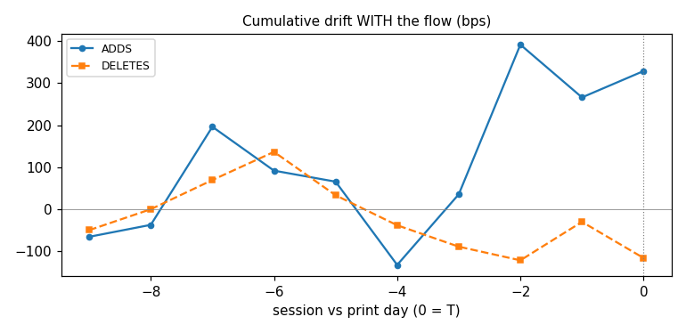
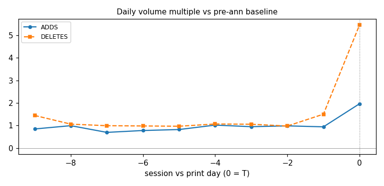
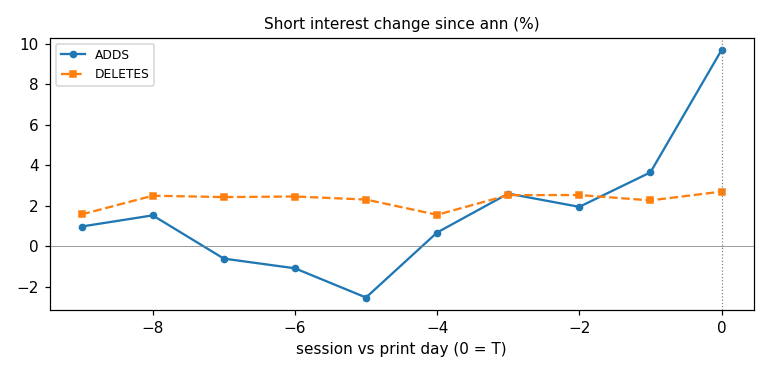
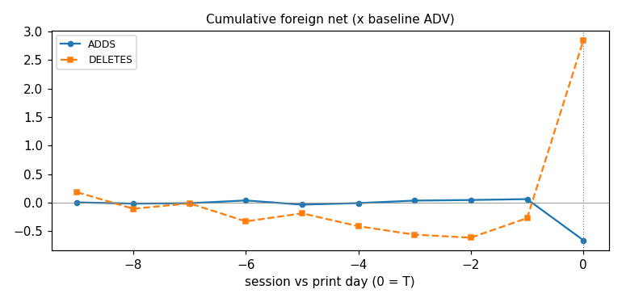

# Step-2 Window Study — Six Keyed TW50 Events (2021-2026), Strict PIT
*Session 9a. 38 event-names, official quotes/shorts/foreign only, every factor computed with data <= its own day. Events: 2021-06, 2021-09, 2023-09, 2024-03, 2025-12, 2026-03.*

## 0. Metric definitions — exact formulas, inputs, edge handling

All inputs are OFFICIAL TWSE files (MI_INDEX all-stock daily quotes,
TWT93U short balances, TWT38U foreign net) — nothing derived from
third-party feeds. Notation: announcement date A (published AFTER
that day's close), effective print day T, sessions k = 1..N strictly
after A through T, relative day rk = k − N (so rk = 0 is the print).

| Metric | Formula | Inputs & units | Edge handling |
|---|---|---|---|
| `pre_close` (P₀) | last official close on or before A | NT$; uncontaminated baseline because the announcement lands post-close | name skipped if missing |
| `base_v` (V₀) | median(daily share volume over the ≤5 sessions ending at A) | shares/day | requires ≥3 sessions, else name skipped |
| `drift_bps(k)` | (closeₖ / P₀ − 1) × 10⁴ | bps vs the pre-announcement price | — |
| `fav_drift(k)` | drift for adds; **−drift** for deletes | bps; positive = price moving WITH the index flow | sign flip only, no scaling |
| `t_mult(k)` | volₖ / V₀ | unitless multiple of baseline volume | None if V₀ = 0 |
| `short_chg(k)` | ((marginₖ+sblₖ)/(margin₀+sbl₀) − 1) × 100, balances from TWT93U, 0 = A-day | % change in TOTAL short interest since announcement | None if A-day balance 0/missing |
| `foreign_cum_x_adv(k)` | Σⱼ≤ₖ (foreign buyⱼ − sellⱼ) / V₀ | cumulative foreign net, in units of baseline-day volumes (×ADV) | missing days contribute 0 |
| track rows | cross-name MEDIAN at each rk, sides separate; `n` = names contributing | medians (robust to the shipping-boom outliers) | rk < −10 trimmed for display |
| counterfactual `cost_bps` | sign × (P_avg / close_T − 1) × 10⁴; sign = +1 Buy / −1 Sell | bps vs the T-close benchmark; NEGATIVE = client beat the close; MOC ≡ 0 by construction | fills at DAILY CLOSES — impact-free upper bounds, stated |
| strategies | LINEAR = mean(close₁..T) · LATE5 = mean(last 5 closes) · EARLY30_MOC70 = 0.3·mean(close₁..₃) + 0.7·close_T · ALL_DAY1 = close₁ | — | — |
| `early_fav_drift_A3` | fav_drift at the close of session 3 | bps; PIT-legal at A+3 | uses session min(3, N) |
| `early_hot` | early_fav_drift_A3 > side median | boolean; IN-SAMPLE split (median chosen on the same 38 names — stated; out-of-sample test = next events) | — |

## 1. The day-by-day factor tracks (median, day rk relative to the print T=0)

### ADDS

| side   |   rk |   fav_drift |   t_mult |   short_chg |   foreign |   n |
|:-------|-----:|------------:|---------:|------------:|----------:|----:|
| Buy    |   -9 |      -65.57 |     0.84 |        0.97 |      0    |  15 |
| Buy    |   -8 |      -37.17 |     0.99 |        1.52 |     -0.02 |  19 |
| Buy    |   -7 |      196.08 |     0.69 |       -0.61 |     -0.01 |  19 |
| Buy    |   -6 |       91.74 |     0.78 |       -1.09 |      0.04 |  19 |
| Buy    |   -5 |       65.57 |     0.82 |       -2.53 |     -0.04 |  19 |
| Buy    |   -4 |     -132.45 |     1.02 |        0.68 |     -0.01 |  19 |
| Buy    |   -3 |       35.59 |     0.95 |        2.6  |      0.03 |  19 |
| Buy    |   -2 |      391.46 |     0.98 |        1.94 |      0.04 |  19 |
| Buy    |   -1 |      265.96 |     0.94 |        3.64 |      0.06 |  19 |
| Buy    |    0 |      328.64 |     1.96 |        9.68 |     -0.66 |  19 |

### DELETES — drift signed WITH flow

| side   |   rk |   fav_drift |   t_mult |   short_chg |   foreign |   n |
|:-------|-----:|------------:|---------:|------------:|----------:|----:|
| Sell   |   -9 |      -49.75 |     1.44 |        1.57 |      0.18 |  15 |
| Sell   |   -8 |       -0    |     1.06 |        2.49 |     -0.11 |  19 |
| Sell   |   -7 |       69.44 |     0.99 |        2.42 |     -0.01 |  19 |
| Sell   |   -6 |      136.41 |     0.98 |        2.45 |     -0.33 |  19 |
| Sell   |   -5 |       33.26 |     0.96 |        2.3  |     -0.19 |  19 |
| Sell   |   -4 |      -38.17 |     1.06 |        1.55 |     -0.42 |  19 |
| Sell   |   -3 |      -89.06 |     1.05 |        2.52 |     -0.56 |  19 |
| Sell   |   -2 |     -121.53 |     0.97 |        2.53 |     -0.62 |  19 |
| Sell   |   -1 |      -30.03 |     1.5  |        2.26 |     -0.27 |  19 |
| Sell   |    0 |     -116.05 |     5.47 |        2.69 |      2.84 |  19 |

## 2. Execution counterfactuals vs the T-close benchmark (median bps; negative = beat the close)

| side   |   LINEAR |   LATE5 |   EARLY30_MOC70 |   ALL_DAY1 |
|:-------|---------:|--------:|----------------:|-----------:|
| Buy    |        3 |     -71 |             -86 |       -630 |
| Sell   |       86 |      88 |              43 |         65 |

## 3. Early-signal conditioning (what A+3 already told you)

|                 |   LINEAR |   LATE5 |
|:----------------|---------:|--------:|
| ('Buy', False)  |      282 |     -57 |
| ('Buy', True)   |     -274 |     -71 |
| ('Sell', False) |      187 |     154 |
| ('Sell', True)  |      -35 |     -55 |

*(early_hot = favorable drift at A+3 above the side's median — a PIT-legal signal on day 3)*

## 4. What the window taught us — the lessons

**L1. The sides are ASYMMETRIC, and the asymmetry is the headline.**
ADDS: every early strategy beat the T-close (day-1-everything:
median **−630 bps**; 30/70 split −86; late-work −71) — the add-side
front-run is real, persistent, and mostly happens EARLY in the
window. DELETES: every working strategy LOST to the close (+43 to
+88 bps) — delete prices fall early, then RECOVER INTO the print
(the covering bounce arriving before T). For this FTSE-class event:
adds reward pre-positioning; deletes reward patience. The MOC
default is right for deletes and expensive for adds.

**L2. Day 3 already knows.** Conditioning on favorable drift at A+3
(PIT-legal — you have it in real time) separates the outcomes:
early-hot adds, working linearly = **−274 bps**; early-cold adds =
+282 (worse than just taking the close). Same shape on deletes
(−35/−55 vs +187/+154). Window momentum PERSISTS: if the name is
moving with the flow by day 3, work it; if it is not, stop and take
the print. This one conditional rule dominates every unconditional
strategy in the sample.

**L3. The discretion matrix gets its drift leg.** The May-2026 MSCI
grading showed crowding correctly called UNPRICED but missed drift
direction on 2/7 names — this study supplies the missing signal:
the A+3 drift check IS the drift leg, measured on 38 names.

**L4. Honesty caveats, stated:** fills at daily closes (price-path
differences, not net-of-impact — a real desk pays spread/impact
working early, so L1's magnitudes are upper bounds); the −630
day-1 number includes the announcement gap (partly uncapturable);
n = 38 names / 6 events, FTSE-class prints (~5x), NOT MSCI-class
(16x) — the MSCI replication runs when the alias bridge lands;
no borrow costs on pre-positioned adds.

**L5. Execution playbook update (Step-2/3 wiring):** (a) adds with
an envelope: deploy the early tranche in the FIRST sessions, not
spread; (b) deletes: default MOC unless A+3 shows the name still
falling; (c) the A+3 checkpoint joins the daily loop as a formal
decision gate (alongside the crowding flip we already grade);
(d) re-run this study on the MSCI cohort + with impact-adjusted
fills via the replay simulator.
